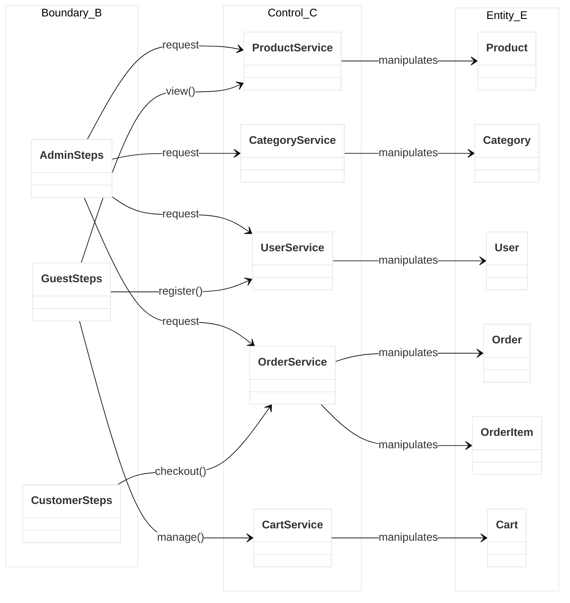
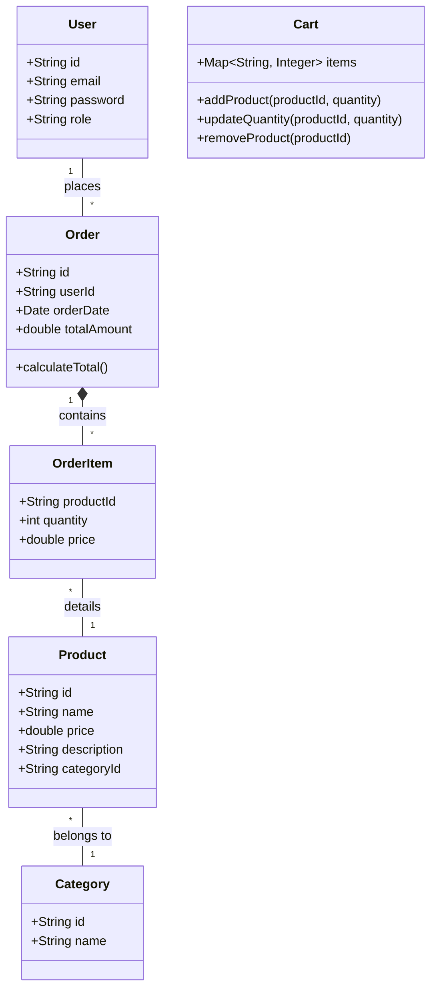
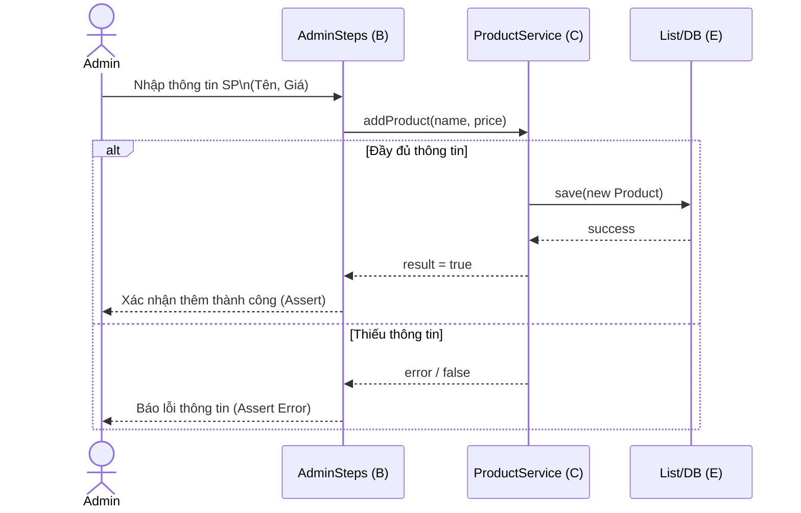
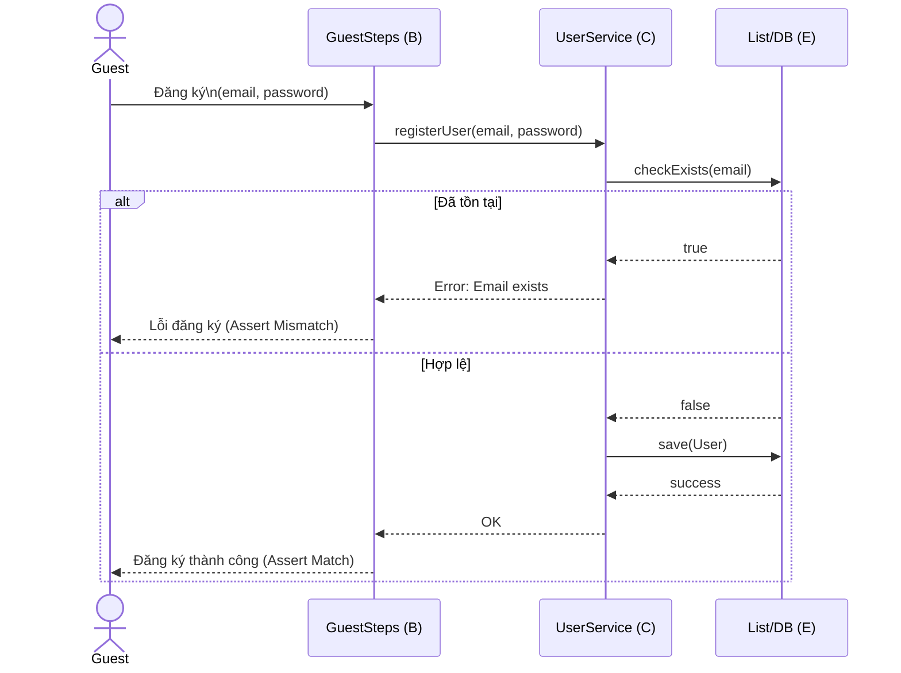
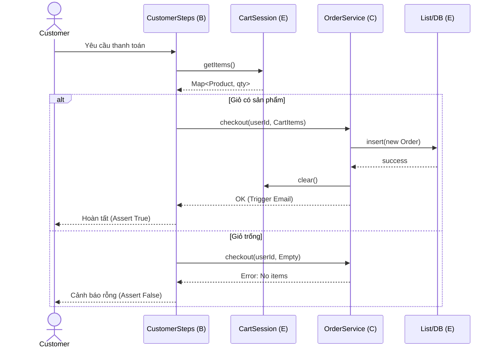

# System Design: E-Commerce BDD/Cucumber Demo

## 1. Architecture
- **Language:** Java
- **Framework:** Cucumber BDD, JUnit
- **Build Tool:** Maven

## 2. BCE Pattern (Boundary - Control - Entity)
Hệ thống được cân nhắc cấu trúc theo mô hình BCE nhằm phân tách rõ ràng luồng tương tác, logic nghiệp vụ chuyên sâu và các đối tượng dữ liệu.

## 3. Class Diagram (Cấu trúc Entities và Data Models)

## 4. Sequence Diagrams
Dưới đây là một số luồng Sequence Diagram điển hình phản ánh trực tiếp quá trình kết nối B-C-E.

### 4.1. Admin Thêm Sản Phẩm Mới

### 4.2. Guest Đăng ký Tài Khoản

### 4.3. Customer Thực Hiện Thanh Toán Phức Tạp
